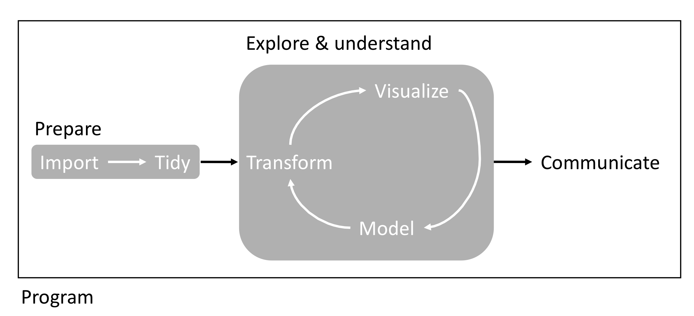

```{r logo, eval=F, echo=F}
htmltools::img(src = knitr::image_uri("Images/boisestate-primarylogo-2color-rgb.png"), 
               alt = 'logo', 
               style = 'position:absolute; top:-90px; right:1%; padding:10px;z-index:200;') # Added width and height as CSS
```

```{js logo-js, echo=FALSE}
$(document).ready(function() {
  $('#header').parent().prepend('<div id=\"logo\"></div>');
  $('#header').css('margin-right', '120px')
});
```

```{r packages, echo=FALSE, warning=FALSE, include=FALSE}
library(knitr)
library(rmarkdown)
library(bookdown)
#library(distill)
library(knitcitations)
library(formatR)
library(devtools)
library(kfigr)
library(dplyr)
library(kableExtra)
library(tufte)

#Generate BibTex citation file for all R packages used to produce report
knitr::write_bib(.packages(), file = 'packages.bib')
```

# Instructor

- Name: Sven Buerki
- Office: Science building, office 114 (ground floor).
- Email: svenbuerki@boisestate.edu
- Office hours: By appointment.

# Meet the team

As part of this VIP course, students will be active members of a research team at BSU and work with the following mentors (in addition to the instructor):

- Dr Anthony Melton (anthonymelton@boisestate.edu): Post Doctoral Research Scientist.
- M.S. Peggy Martinez (peggymartinez@boisestate.edu): Laboratory Technician.
- M.S. Michael Wojahn (mikewojahn@u.boisestate.edu): EEB Ph.D. student.

# Our class ethos

> Everyone here is smart; distinguish yourself by being kind.
>
> `r tufte::quote_footer('Kindness in Science is an inclusive approach that fosters diversity, 	respect, wellbeing & openness leading to better science outcomes.')`

```{r kindness, echo=FALSE, fig.align='right', out.width = '40%', fig.pos= "h"}
knitr::include_graphics("Images/Kindness.png")
```

# VIP BSU webpage

The webpage dedicated to this course is available here:

- https://www.boisestate.edu/vip/genome-2-phenome/

# Course delivery type

To accommodate physical distancing and other safety measures necessitated by the coronavirus pandemic, the university is making changes to its Spring 2021 course schedule. **This course will be taught remotely.** This means that courses meet virtually via technology (here Zoom) at scheduled class meeting times. Students are also expected to be working individually and reporting on their progress during either scheduled class meeting times or individual meetings with their mentors. 

## What technology do you need?

Here are some key points for remote teaching:

-   You will need reliable access to a computer with an internet connection and a webcam.
-   You will need to install a suite of software on your computer ([Zoom](https://boisestate.zoom.us), [R](https://cran.r-project.org), [RStudio](https://www.rstudio.com)). Please see [the computing tools of reproducible science](#software) section below for more details.
-   More information on Zoom provided by BSU is available [here](https://www.boisestate.edu/oit-learning/video/zoom/).
-   VPN access using [Cisco AnyConnect Secure Mobility Client](https://www.cisco.com/c/en/us/support/security/anyconnect-secure-mobility-client-v4-x/model.html#~tab-downloads). This software will facilitate remote access to Linux boxes for bioinformatic analyses. Students using Windows operating systems will have to download Putty or a similar software to remotely access Linux computer using `ssh` protocol. Putty can be downloaded at this URL <http://www.putty.org> (follow instructions to install it on your computer).
-   If you have concerns about access to technology needed for your courses this fall, the [Help Desk](https://www.boisestate.edu/oit/assistance/) is the place to begin to discuss your needs. The instructor would also gladly help you with any technology needs.

# Class schedule

## Meeting days and times

- **Monday from 10:00 AM to 11:00 AM**. 

This time slot will be used for teaching, research lab meetings and presenting scientific results. At the end of our meetings (most likely in the last 10 minutes), we will be taking advantage of the Zoom breakout room feature to allow students to discuss with their mentors and report on their progress as well as set individual weekly expectations.

Finally, we are requiring students to allocate time outside of class to advance their individual research projects (see below for more details). We will be discussing setting-up weekly meetings to discuss with their mentors and reporting progress. 

## Zoom information

Class will take place remotely using the [Zoom](https://boisestate.zoom.us) platform. A fully-licensed Zoom account is available to all faculty, staff, and students at Boise State. Zoom is a great tool for conducting remote meetings that allows you to see and hear one another, chat, share your computer screen, and more. In our case, we will be taking advantage of the remote control and breakout room features. The first feature will allow users to take control of another participant's screen in a meeting. This is especially useful to help working on and debugging R code. The second feature will maximizing communication between students and their mentors. Please see the following Zoom webpages for more details on:

- Remote support session: https://support.zoom.us/hc/en-us/articles/208072316-Remote-Support-Session
- Requesting or giving remote control: https://support.zoom.us/hc/en-us/articles/201362673-Requesting-or-giving-remote-control#heading=h.bdhzh38o7ljq
- Enabling breakout rooms: https://support.zoom.us/hc/en-us/articles/206476093-Enabling-breakout-rooms

## Zoom meeting

Details to join the Zoom meetings are provided [here](https://drive.google.com/drive/folders/1eaOHo6XctGBi92FSZT5nRQPT5jPk5fvl?usp=sharing). Students will be granted access to this folder document prior to the start of the semester.

# Course goal & description

Students are joining a multi-disciplinary team to study the effect of climate change on northwestern US ecosystems. More specifically, students will be contributing to studying the effect of climate change on plants by investigating the contribution of genomic processes in underpinning phenotypes that are adapted to our rapidly changing environment. This will be done by designing, implementing and performing genotype-environment experiments, conducting gene expression analyses and identifying candidate genes underpinning environmental adaptations. Each of those steps in the scientific process will be supported by bioinformatic analyses. To broaden skills, students will receive targeted skills through three modules representing their scientific progression:

- **Module 1:** Bioinformatics (here those tools are geared towards using R and UNIX-based systems to mine, download and analyze genomic data and linking those to phenotypes and environmental conditions).
- **Module 2:** Greenhouse (design and conduct controlled GxE experiments to assess the ability of plants to cope with megadrought). Conducting greenhouse experiments might also involve conducting fieldwork in northwestern US (to collect seeds and tissue for laboratory analyses).
- **Module 3:** Laboratory (e.g. DNA/RNA extractions, qPCR, *in vitro* tissue culture).

Due to the pandemic, the Spring 2021 semester will be devoted on learning and implementing methodologies mostly associated to modules 1 and 2.

This VIP course is integrated into the NSF Idaho EPSCoR [GEM3](https://www.idahogem3.org) program, which will provide opportunities for students to engage with members of this state wide initiative as well as multiple stakeholders (both national and regional).   

## Specific projects you could contribute to

1. Greenhouse maintenance and building phenotypic datasets (e.g. chromosome counts, imaging plants for machine learning) used to link genome to phenome processes.
2. Establishing a reference seed and DNA bank connected to digitized specimens from sagebrush populations. These data will be used to test predictions and validate forecasting models. 
3. Working on a genome database to support [Sagebrush Genome Project](https://svenbuerki.github.io/Sagebrush_Genome_Project/).
4. *In vitro* and *ex vitro* propagation of individual lines for genome assembly and common garden experiments.

# <a name="Structure"></a>Structure of the course

For this semester, the course is subdivided into four parts: 

- *PART 1: Introduction to reproducible science, bioinformatics and genomic tools*
- *PART 2: Produce a research proposal*
- *PART 3: Conduct research project*
- *PART 4: Present your research*

```{r part2, echo=FALSE, fig.cap="Summary of the bioinformatic workflow that will be taught in this course.", out.width = '100%'}

```

Part 1 aims at providing students with key theoretical knowledge on this topic allowing them to successfully design a reproducible approach tailored to genome 2 phenome research. We will also concentrate on learning the RMarkdown computing language to mesh the different steps of the scientific process into a unique framework (see Figure \@ref(fig:part2)). Part 2 will be devoted to work with your mentors in developing an individual research proposal, which will be used as a benchmark to conduct your project (phase 3). Ultimately, this process will lead to the completion of a reproducible report, which will be used to carve an oral presentation at the end of the semester (part 4). We are advising students to start discussing their research questions with the team early in the semester to maximize your research experience. 

# Course learning outcomes

After successful completion of this course, students will be able to:

- Be a kind, respectful and active team member.
- Solve problems.
- Read scientific publications on genome 2 phenome research.
- Conduct a literature review using our *G2Pminer* R package.
- Use your literature review to design a research proposal.
- Establish and manage a common garden experiment.
- Lead and conduct a research project.
- Write a reproducible report.
- Practice communicating scientific results to peers.
- Learn computer programming in R and/or UNIX-based systems (Linux) geared towards analyzing genomic data.

# <a name="GoogleSite"></a>Shared Google Drive

A shared Google drive is set up to facilitate data sharing and allow students uploading their research projects. 

- https://drive.google.com/drive/folders/1eaOHo6XctGBi92FSZT5nRQPT5jPk5fvl?usp=sharing

**Note:** The instructor will give students access to the Google drive folder at the start of the semester.

# <a name="Publis"></a>Publications & textbooks

There are no assigned textbook to this course, however students will be reading scientific papers associated to their individual research projects. The team will be assisting students in reading and understanding scientific papers.

# <a name="software"></a>The computing tools of reproducible science

Research is often presented in the form of slideshows, articles or books. These presentation documents announce a project's findings, but they are not the research, they are the advertisement part of the research project! 

> *The research is the full software environment, code, and data that produced the results [@Donoho2010].* 

**When we separate the research from its advertisement, we are making it difficult for others to verify the findings by reproducing them.**

This course will give you the tools to dynamically combine your research with the presentation of your findings. The first tool will be a workflow for reproducible research weaving the principles of reproducibility throughout your entire research project, from data gathering to the statistical analysis, and the presentation of results. To reach this goal, you will learn how to use a number of computer tools that make this workflow possible. We will also be using a suite of bioinformatic tools associated to analyzing genomic data (e.g. BLAST, DNA alignment, secondary and tertiary protein structure, promoter analyses). We will do our very best to use bioinformatic pipelines, which are available online.

## The bioinformatic tools

The main bioinformatic tools covered in this course are:

- The **R** statistical language that will allow you to gather data and analyze it.
- The **LaTeX** and **Markdown** markup languages that you can use to create documents (slideshows, articles, books, webpages) for presenting your findings.
- The *knitr* and *rmarkdown* **packages** for R and other tools, including **command-line shell programs** like GNU Make and Git version control, for dynamically tiding your data gathering, analysis, and presentation documents together so that they can be easily reproduced.
- **RStudio**, a program that brings all of these tools together in one place.

## Installing the main software

As shown above, **R** and **RStudio** are at the core of this course and will have to be installed on your computers. This can be easily done by downloading the software from the following websites:

- **R**: https://www.r-project.org
- **RStudio**: https://www.rstudio.com/products/rstudio/download/

The download webpages for these software have comprehensive information on how to install them, so please refer to those pages for more information.

## Installing markup languages
If you are planning to create LaTeX documents, you will need to install a Tex distribution. Please refer to this website for more details: https://www.latex-project.org/get/

If you want to create Markdown documents you can separately install the *rmarkdown* package in R (see [below](#Rpack) for more details).

## <a name="Rpack"></a>Installing R packages
We will be using a number of R packages especially designed to support reproducible research. Many of those packages are not included in the default R installation and will need to be installed separately. 
To install key packages used in class, copy the following code and paste it into your R console:

```{r eval=FALSE, tidy=TRUE}
install.packages(c("brew", "countrycode", "devtools", "dplyr", "ggplot2", "googleVis", "knitr", "rmarkdown", "tidyr", "xtable"))
```

Once you enter this code, you may be asked to select a CRAN "mirror" to download the packages from. Simply select the mirror closest to you.

Finally, it is highly likely that we will have to install additional packages. In this case, you can simply install it by using the same R function `install.packages()` or by using RStudio as follows: Select "Tools" -> "Install Packages ..." and then type the name of the package in the window (make sure to tick the "Install dependencies" box).

# <a name="Cheat"></a>RStudio Cheat Sheets: A gold mine to design your bioinformatic tutorials
RStudio provides a suite of cheat sheets that can be accessed by going to the "Help" menu and selecting "Cheatsheets". 

Five cheat sheets are especially relevant to materials taught in this course:

  - *RStudio IDE : Cheat sheet*
  - *Data Manipulation with dplyr, tidyr*
  - *Data Visualization with ggplot2*
  - *R Markdown Cheat Sheet*
  - *R Markdown Reference Guide*

# R tutorials

Please find below two documents providing a comprehensive introduction to R:

- R for beginners (a tutorial by Emmanuel Paradis): https://cran.r-project.org/doc/contrib/Paradis-rdebuts_en.pdf
- An introduction to R: https://cran.r-project.org/doc/manuals/r-release/R-intro.pdf

# Assessment & grading

There will not be any classical exams in this VIP course, but we will rather focus on developing theoretical and bioinformatic skills and applying those to research. In this context, each student will be asked to:

- Attend weekly research lab meetings (TOTAL 32 points; 2 points per lab).
- Produce a research proposal, execute research and write reproducible report (TOTAL 300 points).
- Present their research to their peers (TOTAL 50 points). Last semester students have presented posters at the BSU VIP symposium. We expect this event to be organized at the end of this semester and will therefore requested attendance from our students.

As stated above, we expect students to write their research proposals and reports using the RMarkdown language, which allows integrating data, code and text. We are aware that students are at different stages of their curriculum and have also signed up for 1 or 2 credits. In this context, we will be establishing expectations and associated milestones on an individual basis, but each student will have three graded assessments to deliver (see above to know more about point allocations). Attending research lab meetings is expected semester long (32 points), whereas we will set specific deadlines to produce the research proposal (100 points), execute the research (100 points) and write the reproducible report (100 points). Finally, oral presentations (50 points) will take place during the last two weeks of the semester and consist of 15 minutes powerpoint presentations. The reproducible report should be submitted to the instructor on week 16 for grading. However, we will be grading your research proposal and research execution prior to submission of the final report. Finally, we would like to stress that you are not alone in this endeavor, but rather part of a team. This means that you will be working alongside mentors, which will be able to provide guidance and comment on your research. 

Students will be graded based on the three tasks presented above and those are summing to a total of **382 points**. Table \@ref(tab:mygrade) exhibits the grading scale applied in this course.

```{r mygrade, echo=FALSE}
library(bookdown)
#
grades <- data.frame("Percentage" = c("100-98","97.9-93", "92.9-90", "89.9-88", "87.9-83", "82.9-80", "79.9-78", "77.9-73", "72.9-70", "69.9-68", "67.9-60", "59.9-0"), Grade = c("A+","A","A-","B+","B","B-","C+","C","C-","D+","D","F"))
knitr::kable(grades, caption = "Grading scale applied in this course.")%>%
  kable_styling(bootstrap_options = c("striped", "hover", "condensed"))
```

# Late work policy

The instructor and the team are expecting students to deliver their assignments on time and set enough time aside to work on their projects (see above for more details). However, if you have any issues preventing completion of your work on time, please contact us as soon as possible to find common solutions. 

# Engagement expectations

The remote teaching mode of this course makes it harder for the instructor to take attendance. The instructor is expecting students to attend research lab meetings (please join on time and for the full duration of the meeting) and actively engage by asking questions and giving feedback on teaching material and course content. This course was designed to help students implementing a reproducible approach to their research projects. If you are judging that additional content should be covered, please contact the instructor. The instructor will do his very best to obtain information or seek support from the team to cover the requested material. Finally, the instructor is aware that COVID could potentially impact yourselves and your families. In the case that you have any issues attending class or conducting your research, please contact the instructor by email (svenbuerki@boisestate.edu) asap and see below for more details.

# What you can expect of us

The instructor and the team will be prepared for class, on time and not leave early. We will also be respectful of you and your opinions. Overall, we want to foster a kind and respectful class environment where all students can express themselves and share their opinions. This means that meaningful and constructive dialogue is encouraged in this class and it requires a degree of mutual respect, willingness to listen, and tolerance of opposing points of view. Respect for individual differences and alternative viewpoints will be maintained at all times in this class. One’s words and use of language should be temperate and within acceptable bounds of civility and decency. Finally, we will reply to emails and grade tests as soon as possible (and provide positive criticism) to allow students mastering the material presented in class.

We would like to point out that this is not a classical course since students will be immersed into research. This means that we will do our very best to guide students into research, but we don't have answers to all your questions.

# This course was designed with you in mind

We have developed this course to provide a welcoming environment and effective, equitable learning experience for all students. If you encounter barriers in this course, please bring them to our attention so that we may work to address them.

## This class’s community is inclusive

Students in this class represent a rich variety of backgrounds and perspectives. The Biological Sciences department is committed to providing an atmosphere for learning that respects diversity and creates inclusive environments in our courses. While working together to build this community, we ask all members to:

- Share their unique experiences, values, and beliefs, if comfortable doing so.
- Listen deeply to one another.
- Honor the uniqueness of their peers.
- Appreciate the opportunity we have to learn from each other in this community.
- Use this opportunity together to discuss ways in which we can create an inclusive environment in this course and across the campus community.
- Recognize opportunities to invite a community member to exhibit more inclusive, equitable speech or behavior—and then also invite them into further conversation. We also expect community members to respond with gratitude and to take a moment of reflection when they receive such an invitation, rather than react immediately from defensiveness.
- Keep confidential any discussions that the community has of a personal (or professional) nature, unless the speaker has given explicit permission to share what they have said.
- Respect the right of students to be addressed and referred to by the names and pronouns that correspond to their gender identities, including the use of non-binary pronouns. 

## We use each other’s preferred names and pronouns

Please let us know of your preferred or adopted name and gender pronoun(s), and we will make those changes to our own records and address you that way in all cases. 

To change to a preferred name so that it displays on all BSU sites, including Blackboard and the course roster, contact the Registrar's Office at (208) 426-4249. Note that only a legal name change can alter your name on BSU official and legal documents (e.g., your transcript).

## This course is accessible to students with disabilities

We recognize that navigating your education and life can often be more difficult if you have disabilities. We want you to achieve at your highest capacity in this class. If you have a disability, the instructor needs to know if you encounter inequitable opportunities in this course related to:
- Accessing and understanding course materials.
- Engaging with course materials and other students in the course.
- Demonstrating your skills and knowledge on assignments and exams.

If you have a documented disability, you may be eligible for accommodations in all of your courses. To learn more, make an appointment with the university’s [Educational Access Center](https://www.boisestate.edu/eac/). 

## For students responsible for children

We recognize the unique challenges that can arise for students who are also parents or guardians of children. If you have any specific needs related to this topic, please contact the instructor asap.

# Academic integrity

To create a welcoming, engaging, and effective learning environment, we expect all of us to exhibit behavior that reflects Boise State’s [Statement of Shared Values](https://www.boisestate.edu/president/values/statement-of-shared-values/). The Shared Values emphasize academic excellence, caring, citizenship, fairness, respect, responsibility, and trustworthiness. In keeping with these values, we expect students in this course to uphold the standards outlined in the Boise State University [Student Code of Conduct](https://www.boisestate.edu/policy/student-affairs/code-of-conduct/).

# Student well-being

If you are struggling for any reason (COVID, relationship, family, or life’s stresses) and believe these may impact your performance in the course, we are encouraging you to contact the Dean of Students at (208) 426-1527 or email deanofstudents@boisestate.edu for support. Additionally, if you are comfortable doing so, please reach out to the instructor and he will provide any resources or accommodations that he can. If you notice a significant change in your mood, sleep, feelings of hopelessness or a lack of self worth, consider connecting immediately with Counseling Services (1529 Belmont Street, Norco Building) at (208) 426-1459 or email healthservices@boisestate.edu.

## What do you need?

The university has many resources designed to support you as a learner and human being. Among these are:

- [Albertsons Library](https://library.boisestate.edu/) provides a treasure trove of physical and electronic resources. 
  - As you enter the library, straight ahead you’ll find the Reference Desk, where librarians can help you find the information and resources you need. 
  - The Circulation Desk lets students borrow various technologies.
  - The MakerLab on the second floor offers tools for student use, and there are friendly staff in the MakerLab to help you learn how.
- The [Writing Center](https://www.boisestate.edu/writingcenter/) offers individual consultations tailored to your needs, including making sense of writing assignment instructions, brainstorming, crafting a thesis, organizing an essay, revisions, citations, and more.
- [Counseling Services](https://www.boisestate.edu/healthservices/counseling) helps you tap into your strengths and find resources to deal more effectively with concerns that impact your pursuit of personal and academic goals. It emphasizes prevention and early detection and provides a broad spectrum of short-term counseling, consultative, evaluative, teaching, and training functions. Counseling staff consists of licensed counselors, psychologists, and closely supervised trainees/post-graduate interns.
- The [Gender Equity Center](https://www.boisestate.edu/genderequity/) provides specialized, brief, no-cost, confidential support for campus members affected by:
  - Identity-related harassment.
  - Sexual harassment, sexual assault, unhealthy relationships, and stalking.
  - Life experiences related to gender, sexual orientation, and allyship.
  - Life transitions and crisis.
  - Personal, financial, or academic roadblocks.
- [Multicultural Student Services](https://www.boisestate.edu/mss/) works with all students interested in equity and social justice, students from different cultures, countries and ethnicities. The staff understands cultural differences and perspectives, and knows what it’s like living in a dominant culture. The training and the programs Multicultural Student Services provides can help you navigate through political correctness and into respectful dialogue. This center also provides:
  - Support and guidance for planning cultural festivals and events.
  - In-center tutoring and studying lounge.
  - Volunteer opportunities.
  - Mentoring and Training.
  - Programs and events.
- Food assistance: If you are hungry and cannot afford to purchase food, the campus has some resources to help you. You can visit the [campus food pantry](https://www.boisestate.edu/deanofstudents/student-support/food-help/food-pantry/) or [get free meals in the campus dining hall](https://www.boisestate.edu/deanofstudents/student-support/food-help/meal-assistance/).

# References

<div id="refs"></div>

# Appendix 1 {.appendix}

Citations of all R packages used to generate this report. 

```{r generateBibliography, eval = T, results="asis", cache = F, echo=F, warning = FALSE, message=FALSE}
library("knitcitations")
cleanbib()
options("citation_format" = "pandoc")
read.bibtex(file = "packages.bib")
``` 
